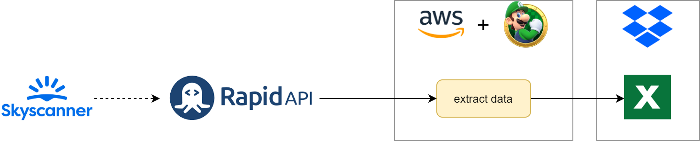

# Personal Assistant with Prefect

This repository contains different **Prefect** tasks that allows me to automate repetitive tasks.

## Tasks

### Expenses/Incomes Report

Since 2010 I have been recording all expenses and incomes. For the last years I have been using [Money Lover](https://moneylover.me/) to do so.
This app has a way to export the data as an Excel file. But the problem is that it does not have the format I want.
So the first task is to clean that data (`clean data`).

With the data cleaned the idea is to create a custom html report using **Jinja2** templates.

In order to make it more flexible there are two tasks:

1. `Extract info` that creates a `yaml` with the info
2. `Create Report` that creates the `html` report with the `yaml` data

With this approach is easy to modify the data or the template without needing to modify the other.

So the pipeline is as follows:

As you can see I use **dropbox** for storing all data this way is easy for me to access or modify it.

The report itself uses [W3css](https://www.w3schools.com/w3css/) for the layout and [Highcharts](https://www.highcharts.com/) for charts.

Here you can see some of the pages the report have:

And of course the report is **responsive**:

### Flights tracker

I regularly travel to Italy and I want to do it as cheap as possible.
So I thought the best way to do it was to let the assistant track all the prices between the airports I wanted and store that data.
Then I could use **Data Analysis** or **Machine Learning** to minimize the price I pay for the flights.

To do so I used the **Rapid API** [Flight Search](https://rapidapi.com/skyscanner/api/skyscanner-flight-search) app.
This API allowed me to query some pairs of airports daily for free.
So right now the assistant is storing a year of data each day so that I can see prices changes and which company offers cheaper flights each day.

As you can see **Rapid API** is getting their data from **Skyscanner**.

A sample of the data:

## Getting info

The assistant is connected to **slack** so that is able to send messages of each task it completes.
It will also give information about any task failure that might happen.

## Nexts steps

The idea is to extend the **slack** integration by creating a chatbot.

This chatbot would allow me to:

* ask about the current state of the tasks
* make the assistant do a task instantaneously
* get feedback of anything I ask

## Authors
* [Arnau Villoro](villoro.com)

## License
The content of this repository is licensed under a [MIT](https://opensource.org/licenses/MIT).

## Nomenclature
Branches and commits use some prefixes to keep everything better organized.

### Branches
* **f/:** features
* **r/:** releases
* **h/:** hotfixs

### Commits
* **[NEW]** new features
* **[FIX]** fixes
* **[REF]** refactors
* **[PYL]** [pylint](https://www.pylint.org/) improvements
* **[TST]** tests
