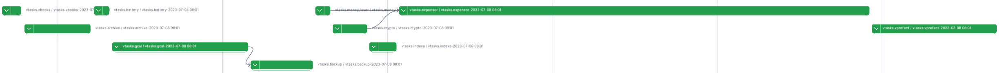
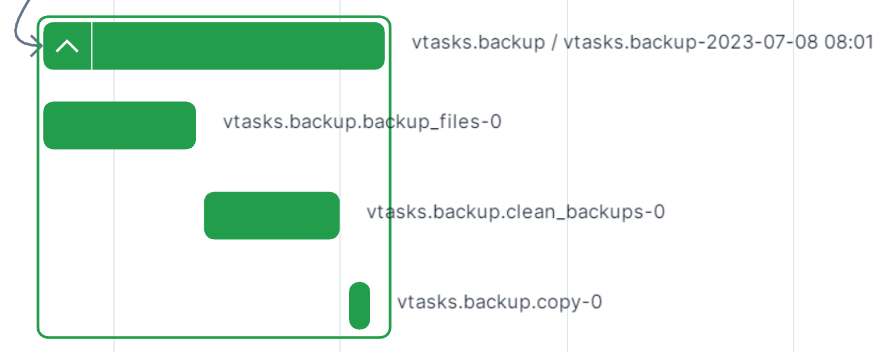

# vtasks: Personal Pipeline
[](https://github.com/pre-commit/pre-commit)

This repository contains my personal pipeline and serves two main purposes:

1. **Learning**: It serves as a playground for trying and learning new things. For example, I've used this repository to try different orchestrators such as [Airflow](https://airflow.apache.org/), [Luigi](https://luigi.readthedocs.io/en/stable/) and [Prefect](https://www.prefect.io/opensource/) which has allowed me to deeply understand the pros and cons of each.
2. **Automating**: This is a real pipeline that runs hourly in production and allows me to automate certain repetitive tasks. You can find more details in the [source](https://github.com/villoro/vtasks/tree/master/src).

## Pipeline Design with Prefect

After trying different orchestrators, I have settled on using [Prefect](https://www.prefect.io/) as my preferred choice. This is mainly due to its simplicity and the fact that the free tier for personal projects works perfectly for my needs.

With Prefect, you work with [Flows](https://docs.prefect.io/2.10.20/tutorial/flows/) (commonly known as `DAG`s in other orchestrators) and [Tasks](https://docs.prefect.io/2.10.20/tutorial/tasks/). The `DAG` is created programmatically by defining `Flows`, which can also have subflows, and `Tasks`.

In my pipeline, there is a main flow called `vtasks`, which calls multiple subflows. Each subflow is composed of multiple tasks. The names of the flows and tasks are hierarchical to simplify monitoring. Here's an overview of the `vtasks` flow:

```plaintext
- vtasks
  ├── vtasks.backup
  │   ├── vtasks.backup.backup_files
  │   ├── vtasks.backup.clean_backups
  │   └── vtasks.backup.copy
  ├── vtasks.expensor
  │   ├── vtasks.expensor.read
  │   └── vtasks.expensor.report
  └── ...
```



And a zoomed-in view of the `vtasks.backup` subflow:




## Subflows

In general, the pipeline is designed to perform the following steps: extracting data from multiple sources, transforming the data, loading it into the cloud, and finally creating interactive plots as `html` files.

1. **Extract**: This step involves integrating with various sources such as APIs, Google Spreadsheets, or app integrations.
2. **Transform**: The transformation step mainly utilizes `pandas` due to its simplicity when handling small amounts of data.
3. **Load**: All the data is stored in Dropbox as `parquet` files. More details about this can be found in the [post: reading and writting using Dropbox](https://villoro.com/post/dropbox_python)
4. **Report**: In this step, static `html` files are created, which contain interactive plots using [highcharts](highcharts.com/) You can read more about this in the [post: create static web pages](https://villoro.com/post/static_webpage)

You can find the definition and details of each subflow in:

| **Subflow**                                                                  | **Description**                                                                                       |
|------------------------------------------------------------------------------|-------------------------------------------------------------------------------------------------------|
| [archive](https://github.com/villoro/vtasks/tree/master/src/archive)         | Helps in archiving files in Dropbox by renaming them and moving them to subfolders based on the year. |
| [backups](https://github.com/villoro/vtasks/tree/master/src/backups)         | Creates dated backups of important files, such as a KeePass database.                                 |
| [battery](https://github.com/villoro/vtasks/tree/master/src/battery)         | Processes the battery log from my phone.                                                              |
| [cryptos](https://github.com/villoro/vtasks/tree/master/src/cryptos)         | Extracts data held in exchanges.                                                                      |
| [expensor](https://github.com/villoro/vtasks/tree/master/src/expensor)       | Creates reports about my personal finances.                                                           |
| [gcal](https://github.com/villoro/vtasks/tree/master/src/gcal)               | Creates information about how I spend my time using Google Calendar data.                             |
| [indexa](https://github.com/villoro/vtasks/tree/master/src/indexa)           | Extracts data from a robo-advisor called [indexa_capital](https://indexacapital.com/).                |
| [money_lover](https://github.com/villoro/vtasks/tree/master/src/money_lover) | Extracts incomes and expenses from the [Money Lover app](https://moneylover.me/)                      |
| [vbooks](https://github.com/villoro/vtasks/tree/master/src/vbooks)           | Creates a report of the books I have read and the reading list.                                       |
| [vprefect](https://github.com/villoro/vtasks/tree/master/src/vprefect)       | Exports information for the flow runs of this pipeline, allowing me to keep a history of all runs.    |

Finally here are some examples of the reports that I end up creating (from the [expensor](https://github.com/villoro/vtasks/tree/master/src/expensor) subflow):


## Deployment

For production, I'm using [Heroku](https://www.heroku.com/) (with the [Eco plan](https://www.heroku.com/pricing) at $5/month) since it greatly simplifies continuous deployment (it has automatic deploys linked to changes in the `main` branch) and maintenance for a small fee. In the past, I used the AWS free tier, but it was harder to maintain.

In terms of scheduling, the pipeline runs hourly and usually takes 6-8 minutes to complete. To avoid wasting resources, I'm using [Heroku Scheduler](https://devcenter.heroku.com/articles/scheduler), which allows me to trigger the pipeline with a cron.

## Author
* [Arnau Villoro](villoro.com)

## License
The content of this repository is licensed under a [MIT](https://opensource.org/licenses/MIT).
